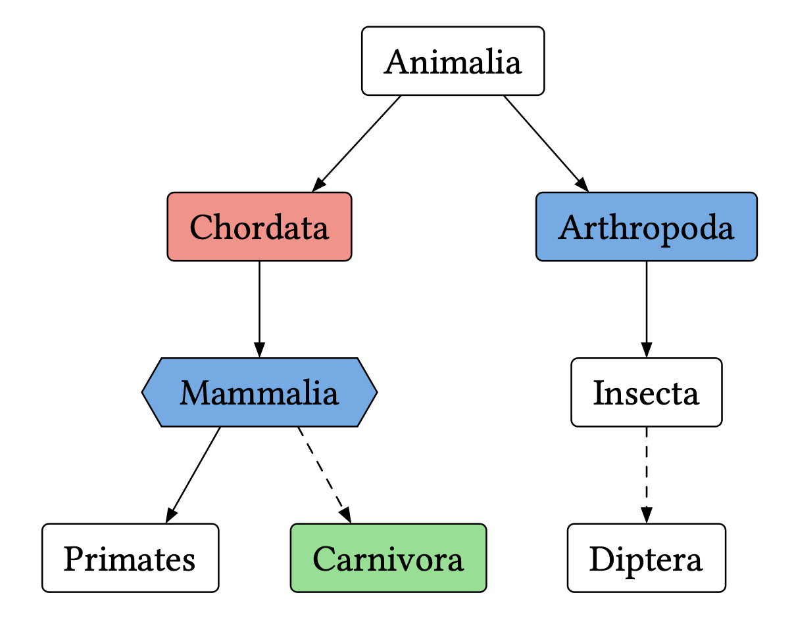
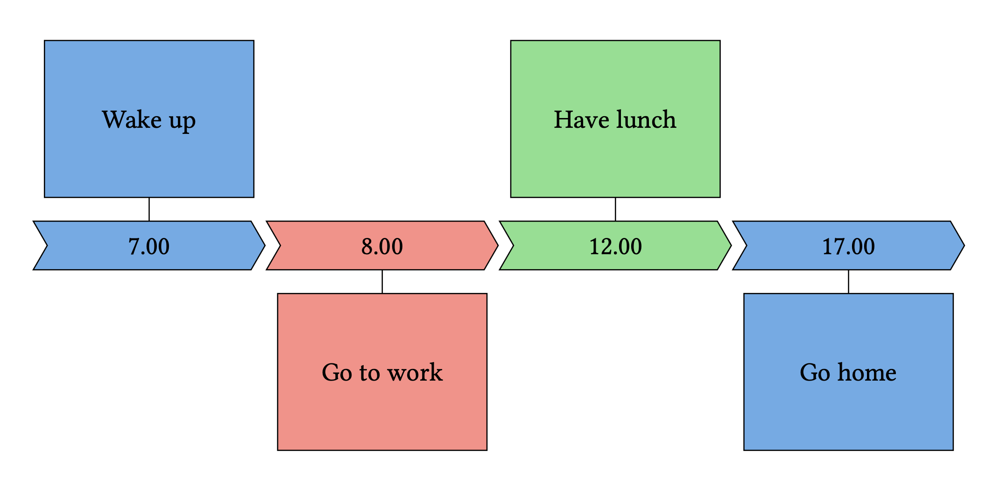
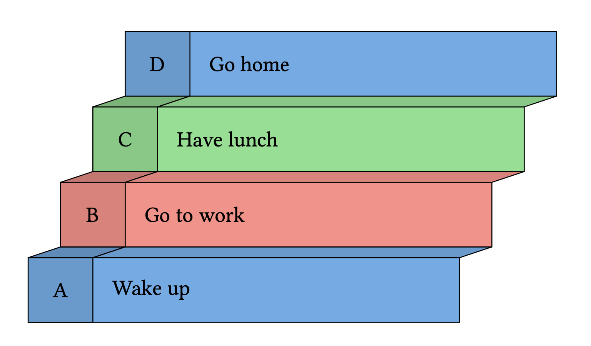

# treechery

This user-friendly [Typst](https://typst.app/) package turns lists into beautiful diagrams. Based on [`cetz`](https://typst.app/universe/package/cetz) and [`fletcher`](https://typst.app/universe/package/fletcher). Read the [`docs`](docs.pdf).

## Examples
We can start by importing the library and defining some styling options for later use.

```typ
#import "@local/treechery:0.1.0": decorate, styling, shapes, tree, timeline, staircase

// Prepare a few styling decorators
#let hexagonal = decorate(shape: shapes.hexagon)
#let dashed = decorate(arrow-stroke: (dash: "dashed"))
#let red = decorate(fill: red.lighten(40%))
#let green = decorate(fill: green.lighten(40%))
#let blue = decorate(fill: blue.lighten(40%))
```

Once this is done we can turn a bullet-list into a tree graph.

```typ
#show list: tree.tree
- Animalia
	- Chordata #red
		- Mammalia #blue#hexagonal
			- Primates 
			- Carnivora #dashed#green
	- Arthropoda #blue
		- Insecta
			- Diptera #dashed
```

<p align="center">
    
</p>

We can turn a terms-list into a timeline.

```typ
#show terms: timeline.timeline
/ 7.00: Wake up #blue
/ 8.00: Go to work #red
/ 12.00: Have lunch #green
/ 17.00: Go home #blue
```

<p align="center">
    
</p>
We can also turn terms-lists into staircase-inspired designs.

```typ
#show terms: staircase.staircase
/ A: Wake up #blue
/ B: Go to work #red
/ C: Have lunch #green
/ D: Go home #blue
```

<p align="center">
    
</p>