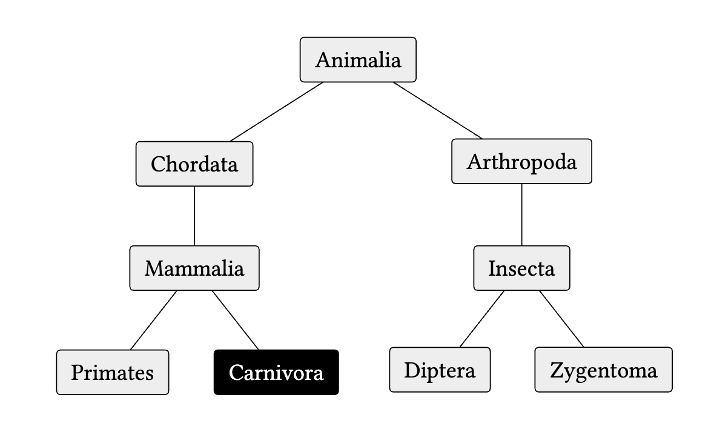

# treechery

This user-friendly [Typst](https://typst.app/) package turns bullet lists into beautiful [`fletcher`](https://typst.app/universe/package/fletcher) diagrams. Read the [`docs`](docs.pdf).

<p align="center">
    
</p>

```typ
#import "@local/treechery:0.1.0": tree, decorate, styling, shapes, algorithms

#show list: tree

// Prepare a few styling decorators
#let hexagonal = decorate(shape: shapes.hexagon)
#let strong = decorate(fill: black, text: white)
#let dashed = decorate(arrow-stroke: (dash: "dashed"))
#let flat = decorate(grow: 0cm, algorithm: algorithms.even-children)

- Animalia #decorate(spread: 3.2cm)
	- Chordata
		- Mammalia #dashed
			- Primates
			- Carnivora #hexagonal#strong
	- Arthropoda
		- Insecta #strong#dashed#flat
			- Diptera #decorate(spread: 1.75cm)
				- Lorem
				- Ipsum
			- Zygentoma
				- Dolor
```